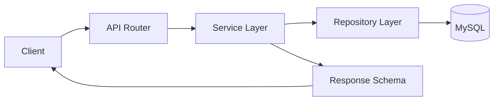

# RoomieMatch Backend Skeleton (FastAPI Monolith)

## 1. Phân tích bài toán và hướng kiến trúc

RoomieMatch là ứng dụng web giải quyết 3 nhu cầu chính:

* Tìm phòng trọ/căn hộ.
* Ghép người ở chung phù hợp.
* Kết nối và trao đổi giữa người dùng.

Với team 3–5 người, hướng **Modular Monolith** là phù hợp nhất:

* Một service duy nhất, triển khai và vận hành đơn giản.
* Một database chính (MySQL 8+) cho auth và dữ liệu nghiệp vụ.
* Chia module theo domain để code không bị rối khi dự án lớn dần.

### Domain chính dự kiến

* `users`: đăng ký/đăng nhập, hồ sơ, thông tin preference.
* `rooms`: đăng tin phòng, chi tiết phòng, tìm kiếm và lọc.
* `matching`: xử lý tiêu chí ghép, tính điểm phù hợp, đề xuất.
* `messaging`: hội thoại và trao đổi thông tin.
* `rental_requests`: gửi/duyệt/từ chối yêu cầu thuê hoặc ở ghép.
* `shared`: thành phần dùng chung (errors, constants, pagination, utility).

### Nguyên tắc tổ chức để tránh code rối

* Luôn đi theo chiều phụ thuộc:

```text
api -> service -> repository -> database
```

* Không để business logic trong router.
* Tách `schemas` (Pydantic DTO) khỏi `models` (ORM entity).
* Hạn chế import chéo giữa module; nếu cần, dùng service boundary rõ ràng.
* Mỗi module có đầy đủ lớp API/Service/Schema/Repository để dễ phân công người làm.

---

# 2. Cấu trúc project đề xuất

### Mục tiêu cấu trúc

* Dễ đọc code và debug.
* Dễ onboard dev mới.
* Dễ chia việc theo module, giảm conflict khi làm song song.

```text
roomie_match_project/
│-- src/
│   │-- app/
│   │   │-- api/
│   │   │   │-- v1/
│   │   │   │   │-- users/
│   │   │   │   │-- rooms/
│   │   │   │   │-- matching/
│   │   │   │   │-- messaging/
│   │   │   │   └── rental_requests/
│   │   │-- services/
│   │   │   │-- users/
│   │   │   │-- rooms/
│   │   │   │-- matching/
│   │   │   │-- messaging/
│   │   │   └── rental_requests/
│   │   │-- schemas/
│   │   │   │-- users/
│   │   │   │-- rooms/
│   │   │   │-- matching/
│   │   │   │-- messaging/
│   │   │   └── rental_requests/
│   │   │-- models/
│   │   │   │-- users/
│   │   │   │-- rooms/
│   │   │   │-- matching/
│   │   │   │-- messaging/
│   │   │   └── rental_requests/
│   │   │-- repositories/
│   │   │   │-- users/
│   │   │   │-- rooms/
│   │   │   │-- matching/
│   │   │   │-- messaging/
│   │   │   └── rental_requests/
│   │   │-- core/
│   │   │-- database/
│   │   └── shared/
│   │       │-- constants/
│   │       │-- errors/
│   │       │-- pagination/
│   │       └── utils/
│   │
│   │-- migrations/
│   │   └── versions/
│   │
│   └── tests/
│       │-- unit/
│       │   │-- users/
│       │   │-- rooms/
│       │   │-- matching/
│       │   │-- messaging/
│       │   └── rental_requests/
│       └── integration/
│           │-- users/
│           │-- rooms/
│           │-- matching/
│           │-- messaging/
│           └── rental_requests/
│
│-- docs/
└── scripts/
```

---

# 3. Giải thích từng thư mục

## `src/app/api/v1/*`

Chứa router theo module.

* Chỉ tiếp nhận request.
* Gọi service.
* Trả response schema.
* Không chứa logic nghiệp vụ phức tạp.

## `src/app/services/*`

Nơi đặt use case/business logic.

* Điều phối dữ liệu từ repository.
* Áp dụng quy tắc nghiệp vụ.
* Mỗi service module độc lập để dễ test đơn vị.

## `src/app/schemas/*`

Pydantic schema cho request/response.

* Validation input/output.
* Định nghĩa contract API.
* Không chứa query DB.

## `src/app/models/*`

ORM model mapping bảng dữ liệu.

* Không đặt API schema vào đây để tránh trộn lớp.

## `src/app/repositories/*`

Chịu trách nhiệm truy vấn DB.

* Tách query logic khỏi service.
* Hỗ trợ đổi ORM hoặc tối ưu query mà không ảnh hưởng router.

## `src/app/database/`

* Kết nối DB.
* Session management.
* Base metadata.
* Nơi tập trung các cấu hình persistence.

## `src/app/core/`

Các thành phần hệ thống dùng chung:

* Config.
* Security helper.
* Startup/shutdown hooks.

## `src/app/shared/*`

Công cụ dùng chung toàn hệ thống:

* `constants`: hằng số dùng chung.
* `errors`: custom exception và mapping lỗi.
* `pagination`: helper phân trang.
* `utils`: utility tái sử dụng.

## `src/migrations/`

Alembic migration scripts.

* `versions/` chứa file version migration.

## `src/tests/`

### `unit/`

Test:

* Service.
* Utils.
* Validation.

### `integration/`

Test luồng:

* API.
* Database.
* Authentication.

## `docs/`

Lưu:

* Convention.
* ADR nhỏ.
* Guideline nghiệp vụ.

## `scripts/`

Lưu script phục vụ:

* Local development.
* CI/CD.
* Automation.

Không đặt logic nghiệp vụ vào đây.

---

# 4. Cách sử dụng FastAPI trong project

## Nguyên tắc phân lớp request

1. Client gọi HTTP endpoint.
2. Router nhận request và parse bằng Pydantic schema.
3. Router gọi service use case.
4. Service gọi repository để đọc/ghi DB.
5. Repository thao tác ORM/session.
6. Service trả kết quả đã xử lý.
7. Router map về response schema và trả cho client.

## Luồng tổng quan



---

# 5. Quy tắc để tránh conflict khi nhiều người làm

## Quy tắc đặt code

* 1 module = 1 nhóm file theo đường dẫn cố định:

```text
api/
services/
schemas/
models/
repositories/
```

* Tên file ưu tiên dạng `snake_case`.
* Tên class dùng `PascalCase`.
* Đặt tên service theo use case.

Ví dụ:

```text
create_room_service.py
```

* Đặt tên router theo resource.

Ví dụ:

```text
rooms_router.py
```

## Quy tắc phối hợp team

* Mỗi người phụ trách 1–2 module domain rõ ràng.
* PR chỉ nên tập trung một module/chủ đề để dễ review.
* Không sửa file shared nếu không cần thiết.
* Nếu sửa shared phải note rõ impact.
* Khi cần dùng logic module khác, gọi qua service contract thay vì import sâu.

## Quy tắc import và boundary

* `api` không import trực tiếp `models`.
* `repository` không import `api`.
* `shared` không phụ thuộc module cụ thể.
* Tránh vòng lặp import.
* Nếu gặp circular import, tách interface/contract vào `shared`.

---

# 6. Cách thêm module mới (ví dụ: payment)

Khi cần thêm domain mới, làm theo checklist:

## Tạo các thư mục

```text
src/app/api/v1/payment/
src/app/services/payment/
src/app/schemas/payment/
src/app/models/payment/
src/app/repositories/payment/
src/tests/unit/payment/
src/tests/integration/payment/
```

## Các bước tiếp theo

1. Đăng ký router của module vào API v1.
2. Thêm migration nếu có thay đổi DB.
3. Cập nhật tài liệu module trong `docs/`.
4. Thêm test unit và integration tối thiểu cho use case chính.
5. Nếu module lớn dần, tiếp tục tách file theo use case nhưng vẫn giữ nguyên structure.

---

# 7. Đề xuất thư viện sử dụng và vai trò

| Thư viện         | Vai trò                                           |
| ---------------- | ------------------------------------------------- |
| FastAPI          | Framework API chính, async-friendly, tự sinh docs |
| Uvicorn          | ASGI server chạy ứng dụng FastAPI                 |
| Pydantic         | Validate request/response schema                  |
| SQLAlchemy       | ORM thao tác MySQL                                |
| Alembic          | Quản lý migration và version schema DB            |
| MySQL            | Cơ sở dữ liệu chính                               |
| PyMySQL          | Driver kết nối MySQL                              |
| Redis (tuỳ chọn) | Cache, rate-limit, queue nhẹ                      |

## Redis dùng khi nào?

* Cache kết quả tìm kiếm/matching.
* Rate limit.
* Session ephemeral.
* Queue nhẹ.

Chưa bắt buộc ở giai đoạn đầu, có thể bổ sung sau.

---

# 8. Chạy ứng dụng và Auth MVP

## Cấu hình môi trường

Sao chép file:

```bash
.env.example -> .env
```

Sau đó điền:

```env
DATABASE_URL=
JWT_SECRET=
```

## Cài đặt

```bash
pip install -e ".[dev]"
```

## Migration

```bash
alembic upgrade head
```

Chạy từ thư mục root repo.

## Chạy server

```bash
uvicorn app.main:app --reload --app-dir src
```

---

# API Auth (v1)

## Đăng ký

```http
POST /api/v1/auth/register
```

Request body:

```json
{
  "email": "user@example.com",
  "password": "secret123",
  "display_name": "Nguyen Van A",
  "account_type": "tenant"
}
```

`account_type`:

* `tenant`
* `landlord`

## Đăng nhập

```http
POST /api/v1/auth/login
```

## Lấy thông tin user hiện tại

```http
GET /api/v1/auth/me
```

Header:

```http
Authorization: Bearer <token>
```

## Chưa làm trong phase này

* Xác thực email.
* OAuth.
* Refresh token.
* API admin.

---

# 9. Ghi chú skeleton ban đầu

Phiên bản skeleton ban đầu chỉ bao gồm:

* Layout project.
* Convention.
* Documentation.

Auth MVP đã bổ sung:

* Code.
* Migration.
* Test cơ bản.

---

# 10. Kết luận

Kiến trúc Modular Monolith phù hợp với RoomieMatch ở giai đoạn đầu vì:

* Dễ triển khai.
* Dễ debug.
* Dễ onboarding.
* Dễ chia việc cho team nhỏ.
* Vẫn đủ khả năng mở rộng khi hệ thống lớn dần.

Việc tách rõ:

```text
API -> Service -> Repository -> Database
```

sẽ giúp:

* Code sạch hơn.
* Hạn chế conflict.
* Dễ test.
* Dễ maintain lâu dài.
* Thuận tiện khi nâng cấp lên microservices trong tương lai nếu cần.
