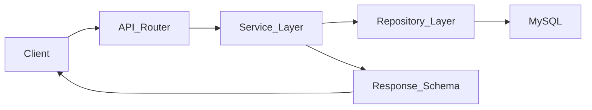

# RoomieMatch Backend Skeleton (FastAPI Monolith)

## 1. Phan tich bai toan va huong kien truc

RoomieMatch la ung dung web giai quyet 3 nhu cau chinh:
- Tim phong tro/can ho.
- Ghep nguoi o chung phu hop.
- Ket noi va trao doi giua nguoi dung.

Voi team 3-5 nguoi, huong **modular monolith** la phu hop nhat:
- Mot service duy nhat, trien khai va van hanh don gian.
- Mot database chinh (**MySQL 8+**) cho auth va du lieu nghiep vu (xem [`docs/database.md`](docs/database.md)).
- Chia module theo domain de code khong bi roi khi du an lon dan.

### Domain chinh du kien
- `users`: dang ky/dang nhap, ho so, thong tin preference.
- `rooms`: dang tin phong, chi tiet phong, tim kiem va loc.
- `matching`: xu ly tieu chi ghep, tinh diem phu hop, de xuat.
- `messaging`: hoi thoai va trao doi thong tin.
- `rental_requests`: gui/duyet/tu choi yeu cau thue hoac o ghep.
- `shared`: thanh phan dung chung (errors, constants, pagination, utility).

### Nguyen tac to chuc de tranh code roi
- Luon di theo chieu phu thuoc: `api -> service -> repository -> database`.
- Khong de business logic trong router.
- Tach `schemas` (Pydantic DTO) khoi `models` (ORM entity).
- Han che import cheo giua module; neu can, dung service boundary ro rang.
- Moi module co day du lop API/Service/Schema/Repository de de phan cong nguoi lam.

## 2. Cau truc project de xuat

Muc tieu cau truc:
- De doc code va debug.
- De onboard dev moi.
- De chia viec theo module, giam conflict khi lam song song.

```text
roomie_match_project/
|-- src/
|   |-- app/
|   |   |-- api/
|   |   |   |-- v1/
|   |   |   |   |-- users/
|   |   |   |   |-- rooms/
|   |   |   |   |-- matching/
|   |   |   |   |-- messaging/
|   |   |   |   `-- rental_requests/
|   |   |-- services/
|   |   |   |-- users/
|   |   |   |-- rooms/
|   |   |   |-- matching/
|   |   |   |-- messaging/
|   |   |   `-- rental_requests/
|   |   |-- schemas/
|   |   |   |-- users/
|   |   |   |-- rooms/
|   |   |   |-- matching/
|   |   |   |-- messaging/
|   |   |   `-- rental_requests/
|   |   |-- models/
|   |   |   |-- users/
|   |   |   |-- rooms/
|   |   |   |-- matching/
|   |   |   |-- messaging/
|   |   |   `-- rental_requests/
|   |   |-- repositories/
|   |   |   |-- users/
|   |   |   |-- rooms/
|   |   |   |-- matching/
|   |   |   |-- messaging/
|   |   |   `-- rental_requests/
|   |   |-- core/
|   |   |-- database/
|   |   `-- shared/
|   |       |-- constants/
|   |       |-- errors/
|   |       |-- pagination/
|   |       `-- utils/
|   |-- migrations/
|   |   `-- versions/
|   `-- tests/
|       |-- unit/
|       |   |-- users/
|       |   |-- rooms/
|       |   |-- matching/
|       |   |-- messaging/
|       |   `-- rental_requests/
|       `-- integration/
|           |-- users/
|           |-- rooms/
|           |-- matching/
|           |-- messaging/
|           `-- rental_requests/
|-- docs/
`-- scripts/
```

## 3. Giai thich tung thu muc

### `src/app/api/v1/*`
- Chua router theo module.
- Chi tiep nhan request, goi service, tra response schema.
- Khong chua logic nghiep vu phuc tap.

### `src/app/services/*`
- Noi dat use case/business logic.
- Dieu phoi du lieu tu repository, ap quy tac nghiep vu.
- Moi service module doc lap de de test don vi.

### `src/app/schemas/*`
- Pydantic schema cho request/response.
- Validation input/output va contract API.
- Khong chua query DB.

### `src/app/models/*`
- ORM model mapping bang du lieu.
- Khong dat API schema vao day de tranh tron lop.

### `src/app/repositories/*`
- Chiu trach nhiem truy van DB.
- Tach rieng query logic khoi service.
- Ho tro doi ORM hoac toi uu query ma khong anh huong router.

### `src/app/database/`
- Ket noi DB, session management, base metadata.
- Noi tap trung cac cau hinh persistence.

### `src/app/core/`
- Cac thanh phan he thong dung chung: config, security helper, startup/shutdown hooks.

### `src/app/shared/*`
- Cong cu dung chung toan he thong:
  - `constants`: hang so dung chung.
  - `errors`: custom exception va mapping loi.
  - `pagination`: helper phan trang.
  - `utils`: utility trung lap.

### `src/migrations/`
- Alembic migration scripts.
- `versions/` chua file version migration.

### `src/tests/`
- `unit/`: test service, utils, validation theo module.
- `integration/`: test luong API-DB.

### `docs/`
- Luu convention, ADR nho, guideline nghiep vu cho team.

### `scripts/`
- Luu script phuc vu local dev/CI (khong dat logic nghiep vu).

## 4. Cach su dung FastAPI trong project

### Nguyen tac phan lop request
1. Client goi HTTP endpoint.
2. Router nhan request va parse bang Pydantic schema.
3. Router goi service use case.
4. Service goi repository de doc/ghi DB.
5. Repository thao tac ORM/session.
6. Service tra ket qua da xu ly.
7. Router map ve response schema va tra cho client.

### Luong tong quan



## 5. Quy tac de tranh conflict khi nhieu nguoi lam

### Quy tac dat code
- 1 module 1 nhom file theo duong dan co dinh: `api`, `services`, `schemas`, `models`, `repositories`.
- Ten file uu tien dang `snake_case`, ten class dang `PascalCase`.
- Dat ten service theo use case, vi du `create_room_service`.
- Dat ten router theo resource, vi du `rooms_router`.

### Quy tac phoi hop team
- Moi nguoi phu trach 1-2 module domain ro rang.
- PR chi nen tap trung mot module/chu de de de review.
- Khong sua file shared neu khong can thiet; neu sua can note ro impact.
- Khi can dung logic module khac, goi qua service contract thay vi import sau.

### Quy tac import va boundary
- `api` khong import truc tiep `models`.
- `repository` khong import `api`.
- `shared` khong phu thuoc module cu the.
- Tranh vong lap import; neu gap, tach interface/contract vao `shared`.

## 6. Cach them module moi (vi du `payment`)

Khi can them domain moi, lam theo checklist:
1. Tao cac thu muc:
   - `src/app/api/v1/payment/`
   - `src/app/services/payment/`
   - `src/app/schemas/payment/`
   - `src/app/models/payment/`
   - `src/app/repositories/payment/`
   - `src/tests/unit/payment/`
   - `src/tests/integration/payment/`
2. Dang ky router cua module vao API v1.
3. Them migration neu co thay doi DB.
4. Cap nhat tai lieu module trong `docs/`.
5. Them test unit va integration toi thieu cho use case chinh.

Neu module lon dan, van giu nguyen structure tren va tach nho file theo use case.

## 7. De xuat thu vien su dung va vai tro

- **FastAPI**: framework API chinh, async-friendly, docs tu dong.
- **Uvicorn**: ASGI server de chay app FastAPI.
- **Pydantic**: validate du lieu request/response, tao schema ro rang.
- **SQLAlchemy**: ORM de thao tac MySQL, linh hoat va pho bien.
- **Alembic**: quan ly migration version hoa schema DB.
- **MySQL**: co so du lieu chinh (driver `pymysql`).
- **Redis (tuy chon)**:
  - Dung cho cache ket qua tim kiem/matching.
  - Dung cho rate-limit, session ephemeral, queue nhe.
  - Chua can bat buoc o giai doan dau, co the bo sung sau.

## 8. Chay ung dung va auth MVP

- Cau hinh bien moi truong: sao chep [`.env.example`](.env.example) thanh `.env` va dien `DATABASE_URL`, `JWT_SECRET`.
- Cai dat: `pip install -e ".[dev]"` (tu thu muc repo).
- Migration: `alembic upgrade head` (tu thu muc repo, dung `alembic.ini`).
- Chay server: `uvicorn app.main:app --reload --app-dir src`.

### API auth (v1)

- `POST /api/v1/auth/register` — email, password, `display_name` (ten hien thi; tam luu cot `accounts.username`), `account_type`: `tenant` | `landlord`.
- `POST /api/v1/auth/login` — email, password.
- `GET /api/v1/auth/me` — header `Authorization: Bearer <token>`.

Chua lam trong phase nay: xac thuc email, OAuth, refresh token, API admin.

## 9. Ghi chu skeleton ban dau

- Ban dau skeleton chi co layout + tai lieu; auth MVP da bo sung code, migration va test.
